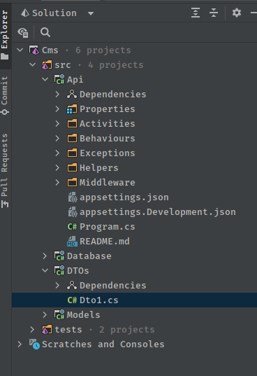

#How to start a new API Solution using API Template Pack

The primary objective of the API Template Pack is to enable developers to be able to quickly and easily start new API projects by attempting to automate most of the grunt work required to get a new projects up running and also to provide useful tools to automate all the boiler plate tasks, enabling developers to focus on the tasks that actually generate value.

The API Template pack enables the creation of project that utilise the best of breed solutions available in the .net ecosystem. API Template pack aims to set the projects up for you and get out of your way and enable you to focus on using the tools with them all preconfigured and ready to go. With every release of the API Template Pack we will endeavour to further improve on this mission.

Many of the decisions and configuration options that have been implemented in the API Template pack have been from our own experience that have worked well for us on projects.

The typical API Template Pack solution come preconfigured with Logging, EntityFramework, Validation, Mapping, Unit Testing tools and more. We attempt to provide an entire local Docker Compose development environment with a PostgreSQL database and Seq as your centralised logging dashboard. We will be adding more as this project continues to evolve.

### Start a new Solution

Once you have [installed the API Template Pack](../start/getting-started "Install API Template Pack") you ready to start generating your new project.

For the purpose of this tutorial we're going to assume you are working Ubuntu and using [Jetbrains Rider IDE](https://www.jetbrains.com/rider/), but the steps will be exactly the same on whichever [operating system with  .net 6 installed](https://docs.microsoft.com/en-us/dotnet/core/install/windows?tabs=net60).

The project will start developing in this walk-through tutorial is a hypothetical Headless Content Management System for a Geek News service, for a *Geekiam*.  We'll be outputting our solution to a code folder and sub directory named Cms

To start the project we'll simply use the command below, the command switches are discussed in [API Solution Template](../start/api-solution).

```shell

dotnet new apisolution -n Cms --Root Geekiam -o code/cms

```

We can  now open our Solution file in Rider to inspect the generated projects.



We have successfully generated our project and can set up our local develop environment we'll need to start developing.  We will need to get our preferred Database setup. API Template pack has chosen to use
PostgreSQL as our preferred database.

To get Postgres up and running is as simple as starting the Docker Compose. Our preferred means of doing is using [How to run docker compose files in Rider](https://garywoodfine.com/how-to-run-docker-compose-files-in-rider/)


